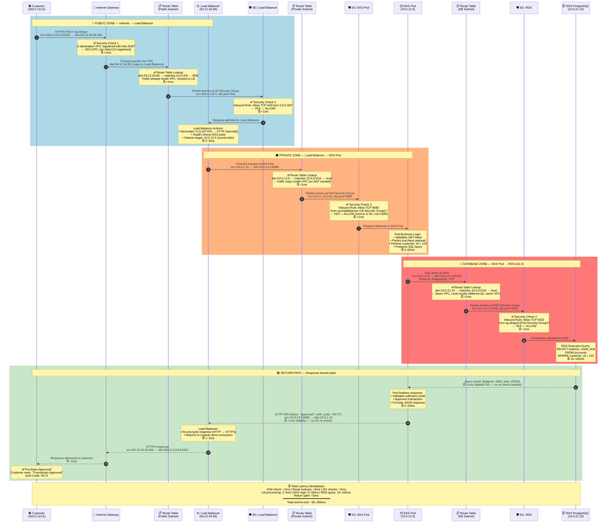

# Network Flow: Customer Request → RDS

Complete sequence diagram showing a credit card purchase request travelling from the public internet through all AWS network layers to the RDS database and back.



---

## Security Checkpoints Summary

| # | Component | Check | Rule | Result |
|---|-----------|-------|------|--------|
| 1 | Internet Gateway | VPC registered? | VPC must be attached to IGW | ✅ Allow |
| 2 | SG: Load Balancer | Port 443 open? | Allow TCP 443 from `0.0.0.0/0` | ✅ Allow |
| 3 | SG: EKS Pod | From LB only? | Allow TCP 8080 from `sg-loadbalancer` | ✅ Allow |
| 4 | SG: RDS | From Pod only? | Allow TCP 5432 from `sg-ekspod` | ✅ Allow |

> **Key insight:** Security Groups 3 and 4 reference *other security groups* as the source, not IP ranges. This means even if an attacker somehow got an IP inside the VPC, they still can't reach the pod or the database — the source must be a resource that actually belongs to the LB/Pod security group.

---

## Route Table Summary

| Route Table | Destination | Target | Meaning |
|-------------|-------------|--------|---------|
| Public Subnet | `0.0.0.0/0` | IGW | All internet traffic via IGW |
| Public Subnet | `10.0.0.0/16` | local | VPC-internal traffic stays local |
| Private Subnet | `10.0.0.0/16` | local | Pod ↔ RDS stays inside VPC |
| Private Subnet | `0.0.0.0/0` | NAT GW | Outbound-only internet (e.g. OS patches) |

---

## Why Traffic Never Touches the Internet Unnecessarily

```
Customer → IGW → Load Balancer (public IP stops here)
                      ↓
              EKS Pod (private IP 10.x.x.x — never exposed)
                      ↓
              RDS     (private IP 10.x.x.x — never exposed)
```

Once the request crosses the Load Balancer, **all traffic uses private RFC-1918 addresses** (`10.0.0.0/16`) and is routed locally within the VPC. The RDS instance has no public IP and cannot be reached from the internet under any circumstances.
