# RDS Patching Flow: Private Subnet (No Internet Required)

How AWS patches an RDS database in a private subnet using VPC Endpoints — the database never touches the public internet.

```mermaid
sequenceDiagram
    autonumber

    participant AWS as ☁️ AWS Patch Manager<br/>(AWS Internal Service)
    participant RDS as 🗄️ RDS PostgreSQL<br/>(10.0.21.10 — Private Subnet)
    participant RT  as 📋 Route Table<br/>(DB Subnet 10.0.21.0/24)
    participant VPE as 🔌 VPC Endpoint<br/>(vpce-s3 — Gateway Type)
    participant S3  as 🪣 S3 Patch Repository<br/>(s3.amazonaws.com — AWS Backbone)

    %% ─────────────────────────────────────────────
    %% PHASE 1 — PATCH DETECTION
    %% ─────────────────────────────────────────────
    rect rgb(173, 216, 230)
        Note over AWS,RDS: 🔵 PHASE 1 — Patch Detection & Notification

        AWS->>RDS: Patch available notification<br/>CVE-2024-XXXX — PostgreSQL 15.4 → 15.5<br/>Severity: HIGH | Auto-apply: YES<br/>Maintenance window: Sun 02:00–04:00 UTC
        Note over RDS: RDS receives patch schedule<br/>• Logs notification internally<br/>• Waits for maintenance window<br/>• No outbound traffic yet<br/>⏱ <1ms (internal signal)

        Note over AWS: AWS Patch Manager checks:<br/>✅ Is instance in maintenance window?<br/>✅ Is multi-AZ failover healthy?<br/>✅ No active connections > threshold?<br/>→ Proceed with patch
    end

    %% ─────────────────────────────────────────────
    %% PHASE 2 — ROUTE TABLE DECISION
    %% ─────────────────────────────────────────────
    rect rgb(255, 220, 150)
        Note over RDS,VPE: 🟡 PHASE 2 — Route Table Lookup (Critical Decision Point)

        RDS->>RT: Outbound request to S3<br/>dst=s3.amazonaws.com (52.216.x.x)<br/>Protocol: HTTPS (443)<br/>⏱ <1ms

        Note over RT: 📋 Route Table Evaluation<br/>━━━━━━━━━━━━━━━━━━━━━━━━━━━<br/>Route 1: 10.0.0.0/16 → local ❌ (not local IP)<br/>Route 2: pl-63a5400a (S3 prefix list) → vpce-s3 ✅<br/>Route 3: 0.0.0.0/0 → NAT GW ❌ (more specific wins)<br/>━━━━━━━━━━━━━━━━━━━━━━━━━━━<br/>→ MATCHED: S3 traffic → VPC Endpoint<br/>⚠️ NAT Gateway is BYPASSED<br/>⏱ <1ms

        RT->>VPE: Route packet to VPC Endpoint<br/>(most specific route wins — prefix list beats 0.0.0.0/0)
        Note over VPE: ✅ VPC Endpoint Policy Check<br/>Allow s3:GetObject from this VPC?<br/>Allow specific S3 bucket: aws-patches-*?<br/>→ YES — ALLOW<br/>⏱ <1ms
    end

    %% ─────────────────────────────────────────────
    %% PHASE 3 — PATCH DOWNLOAD (AWS BACKBONE)
    %% ─────────────────────────────────────────────
    rect rgb(200, 230, 200)
        Note over VPE,S3: 🟢 PHASE 3 — Patch Download via AWS Internal Network

        VPE->>S3: HTTPS GET /patches/postgresql-15.5.tar.gz<br/>🔒 TLS 1.3 encrypted<br/>🏠 AWS backbone network (no internet)<br/>⏱ <1ms (same AWS region)

        Note over S3: S3 bucket: aws-rds-patches-us-east-1<br/>• Verifies VPC Endpoint policy<br/>• Checks object ACL / bucket policy<br/>• Prepares object for transfer<br/>⏱ 2–10ms

        S3-->>VPE: Patch file stream begins<br/>postgresql-15.5.tar.gz (45 MB)<br/>🔒 Encrypted in transit (TLS 1.3)<br/>✅ Integrity hash: SHA-256 included<br/>⏱ 500ms–2s (45 MB over private link)

        Note over VPE: VPC Endpoint streams data<br/>directly into VPC memory space<br/>No internet routing table consulted<br/>No IGW traversal<br/>⏱ passthrough
    end

    %% ─────────────────────────────────────────────
    %% PHASE 4 — PATCH DELIVERY TO RDS
    %% ─────────────────────────────────────────────
    rect rgb(255, 179, 128)
        Note over RT,RDS: 🟠 PHASE 4 — Patch Delivered to RDS (Private Subnet)

        VPE-->>RT: Return traffic<br/>src=S3 (via VPC Endpoint)<br/>dst=10.0.21.10:443<br/>⏱ <1ms

        Note over RT: Return route lookup<br/>dst=10.0.21.10 → 10.0.0.0/16 → local<br/>→ Forward directly to RDS<br/>⏱ <1ms

        RT-->>RDS: Patch file delivered<br/>10.0.21.10 receives complete download<br/>⏱ <1ms

        Note over RDS: RDS Validates Patch:<br/>✅ SHA-256 checksum: MATCH<br/>✅ AWS signature verified<br/>✅ Version compatible: 15.4 → 15.5<br/>✅ No disk space issues<br/>⏱ 1–3s (checksum + validation)
    end

    %% ─────────────────────────────────────────────
    %% PHASE 5 — PATCH APPLICATION
    %% ─────────────────────────────────────────────
    rect rgb(220, 180, 255)
        Note over RDS: 🟣 PHASE 5 — Patch Application (Internal to RDS)

        Note over RDS: Pre-patch steps (AWS managed):<br/>1. Final automated snapshot created<br/>2. Multi-AZ standby patched FIRST<br/>3. Standby promoted to primary<br/>4. Original primary patched<br/>⏱ 5–20 minutes total

        RDS->>RDS: Apply postgresql-15.5 patch<br/>• Stop DB engine<br/>• Replace binaries<br/>• Run migration scripts<br/>• Restart DB engine<br/>⏱ 60–120 seconds downtime (Multi-AZ: ~30s failover)

        Note over RDS: Post-patch verification:<br/>✅ DB engine version = 15.5<br/>✅ All connections restored<br/>✅ Replication lag = 0ms<br/>✅ Performance baseline normal
    end

    %% ─────────────────────────────────────────────
    %% PHASE 6 — CONFIRMATION
    %% ─────────────────────────────────────────────
    rect rgb(173, 216, 230)
        Note over AWS,RDS: 🔵 PHASE 6 — Patch Confirmation

        RDS->>RT: Outbound confirmation to AWS<br/>dst=rds.us-east-1.amazonaws.com<br/>via VPC Endpoint (Interface type)<br/>⏱ <1ms

        RT->>VPE: Route: rds endpoint prefix → vpce-rds<br/>⏱ <1ms

        VPE->>AWS: Patch status report<br/>instance-id: db-XXXX<br/>patch: postgresql-15.5<br/>status: SUCCESS<br/>applied_at: 2026-04-09T02:47:00Z<br/>⏱ <1ms

        AWS-->>RDS: Acknowledgement<br/>Patch recorded in AWS Console<br/>Next maintenance window scheduled<br/>⏱ <1ms
    end

    %% ─────────────────────────────────────────────
    %% TOTAL SUMMARY
    %% ─────────────────────────────────────────────
    Note over AWS,S3: ⏱ End-to-End Patch Timeline<br/>Phase 1 — Detection & scheduling: <1ms<br/>Phase 2 — Route table lookup: <1ms<br/>Phase 3 — Patch download (45MB): ~1–2s<br/>Phase 4 — Delivery + validation: ~3s<br/>Phase 5 — Patch application: ~5–20 min<br/>Phase 6 — Confirmation: <1ms<br/>━━━━━━━━━━━━━━━━━━━━━━━━━━━━━━━━━━━━<br/>Total window: ~5–20 minutes (Multi-AZ: ~30s visible downtime)
```



---

## Why RDS Never Touches the Internet

```
WITHOUT VPC Endpoint (insecure path — not used):
  RDS → Route Table → NAT Gateway → Internet Gateway → Public Internet → S3
                                          ☠️ Exposed to internet

WITH VPC Endpoint (actual path — used here):
  RDS → Route Table → VPC Endpoint → AWS Backbone Network → S3
                           ✅ Never leaves AWS infrastructure
```

The route table has **two possible routes** for S3 traffic:

| Priority | Route | Target | Used? |
|----------|-------|--------|-------|
| High (specific) | `pl-63a5400a` (S3 prefix list) | `vpce-s3` | ✅ YES |
| Low (default) | `0.0.0.0/0` | NAT Gateway | ❌ Bypassed |

Longest/most-specific prefix wins — S3's prefix list is always more specific than `0.0.0.0/0`, so the VPC Endpoint route always wins.

---

## VPC Endpoint Types Used

| Endpoint | Type | Used For | Cost |
|----------|------|----------|------|
| S3 VPC Endpoint | **Gateway** | Patch downloads from S3 | Free |
| RDS VPC Endpoint | **Interface** | Patch status reporting | ~$7/mo |

**Gateway endpoints** (S3, DynamoDB) — free, work via route table entries.
**Interface endpoints** (everything else) — paid, create an ENI inside your subnet.

---

## Security Guarantees

| Threat | Protection |
|--------|-----------|
| Man-in-the-middle | TLS 1.3 encryption end-to-end |
| Tampered patch file | SHA-256 checksum + AWS signature verification |
| Unauthorized S3 bucket access | VPC Endpoint policy restricts to `aws-rds-patches-*` only |
| Internet exposure | No IGW, no NAT, no public IP on RDS — impossible to reach from internet |
| Lateral movement in VPC | RDS Security Group allows inbound only from Pod SG (port 5432) |
